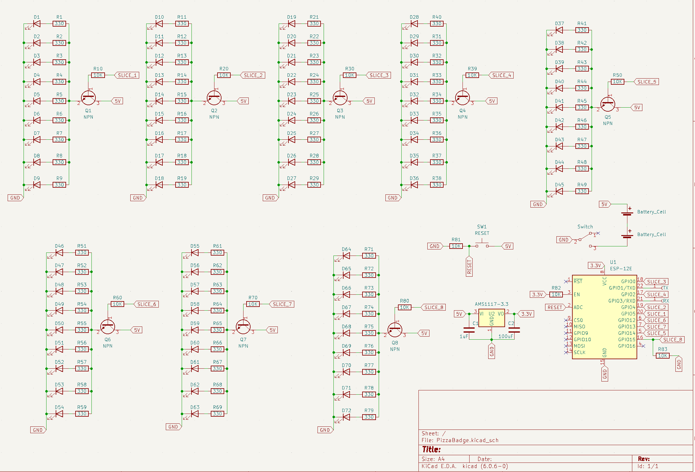

# Pizza Badge

8 Slices pizza badge presented with LEDs. Slices will light when they receive response from server how many points you have.

## Scheme

## Boards
Board|PCB Empty|PCB filled
---------|---------|---------
||

## 3D Case
With PCB|Case Empty
---------|---------
|

## PCB Design

For PCB design i will use services from SeeedFusion. 

Seeed Fusion PCB Assembly Service offers one-stop prototyping for PCB manufacture, PCB assembly and as a result they produce superior quality PCBs and Fast Turnkey PCBA from 7 working days. When you prototype with Seeed Fusion, they can definitely provide Free DFA and Free functional tests for you! 

Check out their website to know about their manufacturing capabilities and service.
https://www.seeedstudio.com/prototype-pcb-assembly.html 

## Seeed Fusion PCBs
Empty PCB|Finished PCB
--------|--------
|

## Demo

## Reasons to choose Seeed Studio
- They provide PCB services at extremely low pricing and with excellent quality.
- Their offer is structured in such a way that everyone may have these boards at a reasonable price.
- They have a highly knowledgeable crew that leads their clients to avail deals and guides them about the costs and rates of different services.
- A four-layer board with a comparable feature costs $5 for 10 pieces and is made in four days.
- SMT stencil with size (10cm x 13cm) is available for $8.00 per piece.
